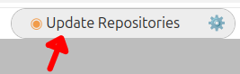
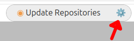
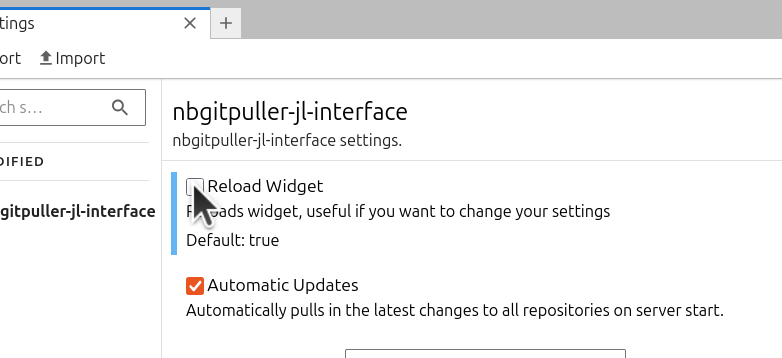
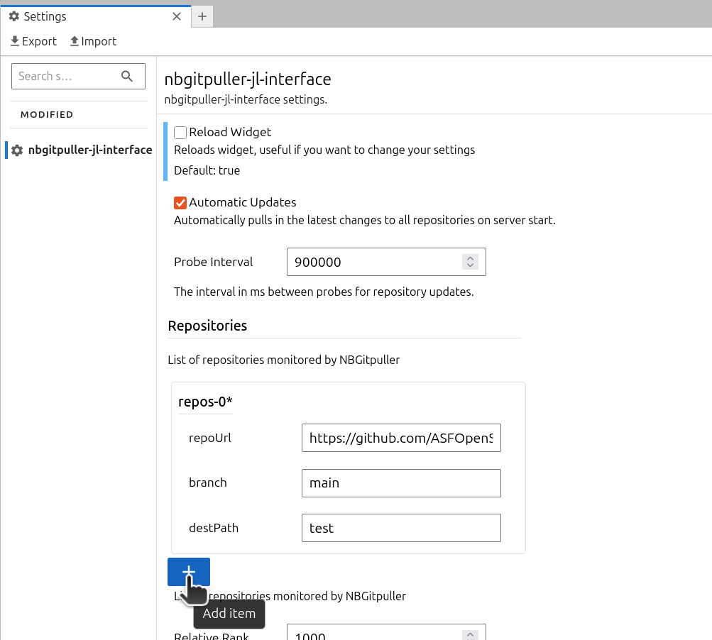

# nbgitpuller_jl_interface

[](https://github.com/ASFOpenSARlab/nbgitpuller-jl-interface/actions/workflows/build.yml)

A human interface with nbgitpuller in JupyterBook

This extension is composed of a Python package named `nbgitpuller_jl_interface`
for the server extension and a NPM package named `nbgitpuller-jl-interface`
for the frontend extension.

## Requirements

- JupyterLab >= 4.0.0

## Install

To install the extension, execute:

```bash
pip install nbgitpuller_jl_interface
```

## Uninstall

To remove the extension, execute:

```bash
pip uninstall nbgitpuller_jl_interface
```

## Usage

### Pull Repository Changes

To update your repositories, click the update button.



### Edit Settings

You can find the extension settings by clicking the gear icon.



#### Apply Changes

To apply changes, the widget must be reloaded. Check the `Reload Widget` checkbox to reload the widget. It will uncheck itself after the widget is reloaded.



#### Add More Repositories

In nbgitpuller-jl-interface settings, under Repositories click the plus icon. Fill out the following fields.
* repoUrl: The repository URL
* branch: The branch of the repository to watch
* destPath: The destination folder to download the repository to



#### Additional Settings

**Automatic Updates**: If on will automatically pull repository updates on server start or browser refresh.

**Probe Interval**: The interval between probes for repository updates. Defaults to 15 minutes

**Relative Rank**: Affects position of widget in the menu bar.

## Troubleshoot

If you are seeing the frontend extension, but it is not working, check
that the server extension is enabled:

```bash
jupyter server extension list
```

If the server extension is installed and enabled, but you are not seeing
the frontend extension, check the frontend extension is installed:

```bash
jupyter labextension list
```

## Contributing

If you would like to contribute to this extension, please refer to the [Contributing Guide](CONTRIBUTING.md).
